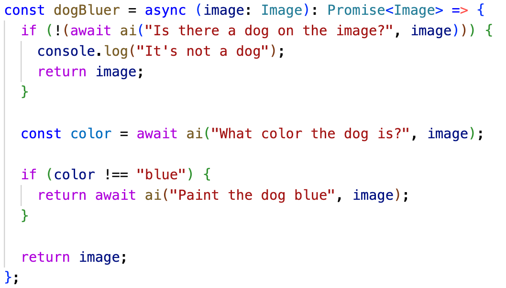

# 🎮 text-to-ml

Run AutoML using natural text. Like HuggingGPT + LangChain + type inference

It picks a right model from Hugging Face library based on user natural language query and then runs the model and parses the output to a type, inferred from the query

<p align="center"></p>

It's still an early project, so feel welcome to contribute!

## Setup

1. Get OpenAI API Key
2. Get Hugging Face API Key
3. Create an assistant and copy its id
4. Create `.env` file and fill it with values:

```
OPENAI_API_KEY=
HF_TOKEN=
```

## Build

```sh
conda create -n text-to-ml python=3.9
conda activate text-to-ml
conda install --file requirements.txt
```

## Run

```
python app.py
```

## Run experiments

```
python experiments.py
```

## License

GPLv3

## Author

Jędrzej Paweł Maczan, Poland, 2024
